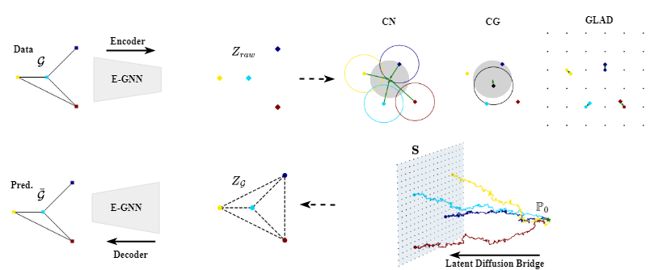

GLAD: Improving Latent Graph Generative Modeling with Simple Quantization
---
### Abstract
Exploring the graph latent structures has not garnered much attention in the graph generative research field. Yet, exploiting the latent space is as crucial as working on the data space for discrete data such as graphs. However, previous methods either failed to preserve the permutation symmetry of graphs or lacked an effective approaches to model appropriately within the latent space. To mitigate those issues, we propose a simple, yet effective discrete latent graph diffusion generative model. Our model, namely GLAD, not only overcomes the drawbacks of existing latent approaches, but also alleviates inherent issues present in diffusion methods applied on the graph space. We validate our generative model on the molecular benchmark datasets, on which it demonstrates competitive performance compared with the state-of-the-art baselines. 

<p align="center">
    
</p>

## Dependencies
---

GLAD is built upon **Python 3.10.1** and **Pytorch 1.12.1**. To install additional packages, run the below command:

```sh
pip install -r requirements.txt
```

And `rdkit` for molecule graphs:

```sh
conda install -c conda-forge rdkit=2020.09.1.0
```

## Data setups

We follow the GDSS repo [[Link](https://github.com/harryjo97/GDSS/tree/master)] to set up the dataset benchmarks.

We benchmark GLAD on three **generic graph datasets** (Ego-small, Community_small, ENZYMES) and two **molecular graph datasets** (QM9, ZINC250k).

To generate the generic datasets, run the following command:

```sh
python data/data_generators.py --dataset ${dataset_name}
```

To preprocess the molecular graph datasets for training models, run the following command:

```sh
python data/preprocess.py --dataset ${dataset_name}
python data/preprocess_for_nspdk.py --dataset ${dataset_name}
```

For the evaluation of generic graph generation tasks, run the following command to compile the ORCA program (see http://www.biolab.si/supp/orca/orca.html):

```sh
cd src/metric/orca 
g++ -O2 -std=c++11 -o orca orca.cpp
```

## Training

We provide GLAD's hyperparameters in the `config` folder.

The first stage, train the finite scalar quantization autoencoder:

```sh
sh run -d ${dataset} -t base -e exp -n ${dataset}_base
```

where:
- `dataset`: data type (in `config/data`)
- `dataset_base`: autoencoder base (in `config/exp/{dataset}_base`)

Example:

```sh
sh run -d qm9 -t base -e exp -n qm9_base
```

The sencod stage, train the discrete latent graph diffusion bridges:


```sh
sh run -d ${dataset} -t bridge -e exp -n ${dataset}_bridge
```

where:
- `dataset`: data type (in `config/data`)
- `dataset_bridge`: diffusion bridge (in `config/exp/{dataset}_bridge`)

Example:

```sh
sh run -d qm9 -t bridge -e exp -n qm9_bridge
```

## Inference

We provide code that caculates the mean and std of different metrics on generic graphs (15 sampling runs) and molecule graphs (3 sampling runs).

```sh
sh run -d ${dataset} -t sample -e exp -n ${dataset}_bridge
```

Example:

```sh
sh run -d qm9 -t sample -e exp -n qm9_bridge
```

Download our model weights:
```sh
sh download.sh
```
