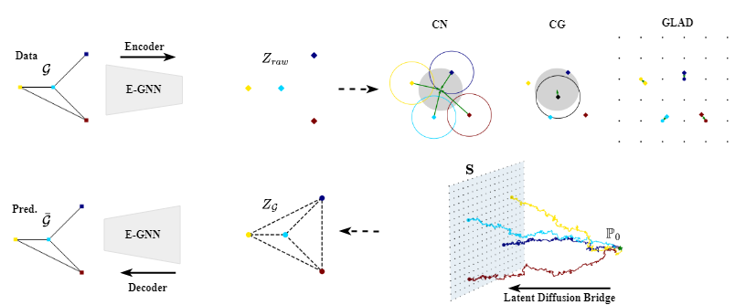

# GLAD
Discrete Latent Graph Generative Modeling with Diffusion Bridges
---
### Abstract


Learning graph generative models over latent spaces has received  less attention compared to models that operate on the original data space and has so far demonstrated lacklustre performance. We present GLAD a latent space graph generative model. Unlike most previous latent space graph generative models, GLAD operates on a discrete latent space that preserves to a significant extent the discrete nature of the graph structures making no unnatural assumptions such as latent space continuity. We learn the prior of our discrete latent space by adapting diffusion bridges to its structure. By operating over an appropriately constructed latent space we avoid relying on decompositions that are often used in models that operate in the original data space. We present experiments on a series of graph benchmark datasets which clearly show the superiority of the discrete latent space and obtain state of the art graph generative performance, making GLAD the first latent space graph generative model with competitive performance.

<p align="center">
    
</p>

## Dependencies
---

GLAD is built upon **Python 3.10.1** and **Pytorch 1.12.1**. To install additional packages, run the below command:

```sh
pip install -r requirements.txt
```

And `rdkit` for molecule graphs:

```sh
conda install -c conda-forge rdkit=2020.09.1.0
```

## Data setups

We follow the GDSS repo [[Link](https://github.com/harryjo97/GDSS/tree/master)] to set up the dataset benchmarks.

We benchmark GLAD on three **generic graph datasets** (Ego-small, Community_small, ENZYMES) and two **molecular graph datasets** (QM9, ZINC250k).

To generate the generic datasets, run the following command:

```sh
python data/data_generators.py --dataset ${dataset_name}
```

To preprocess the molecular graph datasets for training models, run the following command:

```sh
python data/preprocess.py --dataset ${dataset_name}
python data/preprocess_for_nspdk.py --dataset ${dataset_name}
```

For the evaluation of generic graph generation tasks, run the following command to compile the ORCA program (see http://www.biolab.si/supp/orca/orca.html):

```sh
cd src/metric/orca 
g++ -O2 -std=c++11 -o orca orca.cpp
```

## Training

We provide GLAD's hyperparameters in the `config` folder.

The first stage, train the finite scalar quantization autoencoder:

```sh
sh run -d ${dataset} -t base -e exp -n ${dataset}_base
```

where:
- `dataset`: data type (in `config/data`)
- `dataset_base`: autoencoder base (in `config/exp/{dataset}_base`)

Example:

```sh
sh run -d qm9 -t base -e exp -n qm9_base
```

The sencod stage, train the discrete latent graph diffusion bridges:


```sh
sh run -d ${dataset} -t bridge -e exp -n ${dataset}_bridge
```

where:
- `dataset`: data type (in `config/data`)
- `dataset_bridge`: diffusion bridge (in `config/exp/{dataset}_bridge`)

Example:

```sh
sh run -d qm9 -t bridge -e exp -n qm9_bridge
```

## Inference

We provide code that caculates the mean and std of different metrics on generic graphs (15 sampling runs) and molecule graphs (3 sampling runs).

```sh
sh run -d ${dataset} -t sample -e exp -n ${dataset}_bridge
```

Example:

```sh
sh run -d qm9 -t sample -e exp -n qm9_bridge
```

Download our model weights:
```sh
sh download.sh
```
For each dataset, we saved the last and best checkpoints during training. In the paper, we reported on the checkpoints that yielded the best mean results from different runs during sampling.

# Citation

Please refer to our work if you find our paper with the released code useful in your research. Thank you!

```
@article{nguyen2024discrete,

  title={Discrete Latent Graph Generative Modeling with Diffusion Bridges},

  author={Nguyen, Van Khoa and Boget, Yoann and Lavda, Frantzeska and Kalousis, Alexandros},

  journal={arXiv preprint arXiv:2403.16883},
  year={2024}
}
```